# Gender-Recognition-by-Voice-and-Speech-Analysis
## To identify a voice as male or female, based upon acoustic properties of the voice and speech.

**Author**: SHAILESH DHAMA

### Business problem:

To identify a voice as male or female, based upon acoustic properties of the voice and speech.

### DATASET :

This database was created to identify a voice as male or female, based upon acoustic properties of the voice and speech. 
The dataset consists of 3,168 recorded voice samples, collected from male and female speakers.
The voice samples are pre-processed by acoustic analysis in R using the seewave and tuneR packages, with an analyzed frequency range of 0hz-280hz (human vocal range).

The following acoustic properties of each voice are measured and included within the CSV:

    *meanfreq* : mean frequency (in kHz)
    *sd: standard deviation of frequency
    *median: median frequency (in kHz)
    *Q25: first quantile (in kHz)
    *Q75: third quantile (in kHz)
    *IQR: interquantile range (in kHz)
    *skew: skewness (see note in specprop description)
    *kurt: kurtosis (see note in specprop description)
    *sp.ent: spectral entropy
    *sfm: spectral flatness
    *mode: mode frequency
    *centroid: frequency centroid (see specprop)
    *peakf: peak frequency (frequency with highest energy)
    *meanfun: average of fundamental frequency measured across acoustic signal
    *minfun: minimum fundamental frequency measured across acoustic signal
    *maxfun: maximum fundamental frequency measured across acoustic signal
    *meandom: average of dominant frequency measured across acoustic signal
    *mindom: minimum of dominant frequency measured across acoustic signal
    *maxdom: maximum of dominant frequency measured across acoustic signal
    *dfrange: range of dominant frequency measured across acoustic signal
    *modindx: modulation index. Calculated as the accumulated absolute difference between adjacent measurements of fundamental frequencies divided by the frequency range.
    *label: male or female

## STEPS :

    - Dataset description
    - Data Preprocessing
    - kdeplot visualization of M & F ratio.
    - Classification
      - K-Nearest Neighbors
      - Decision Tree
      - Random Forest
      - XgBoost
      - Support Vector Machine
    - 3-layer Neural Network Modelling.
    
## RESULTS :

#### Data Visualisation :

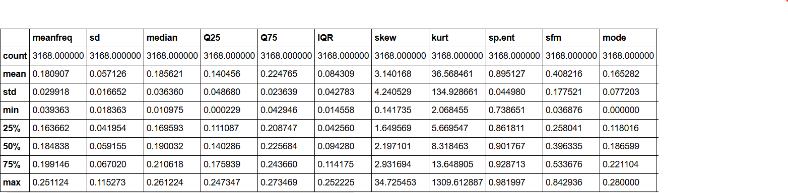
> Dataset description

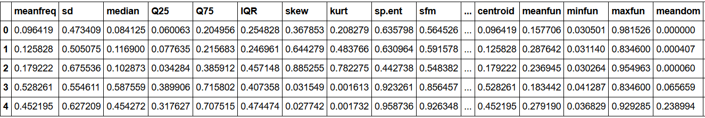
> Data Preprocessing

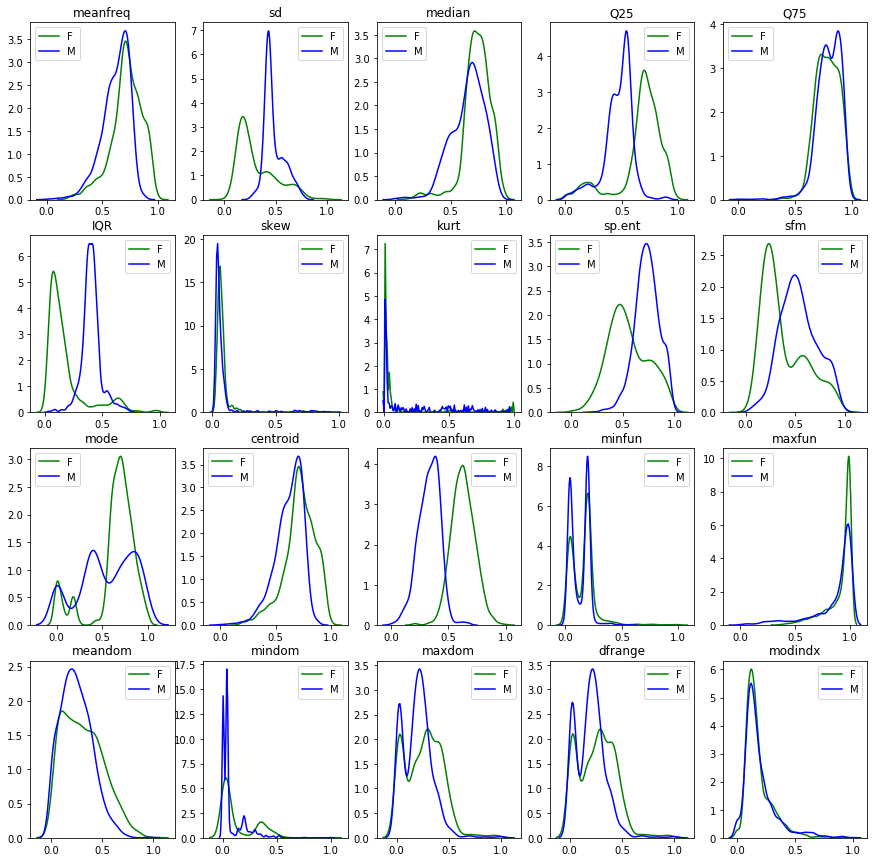
> kdeplot visualization of M & F ratio.

#### Classification Error rate :

##### K-Nearest Neighbors
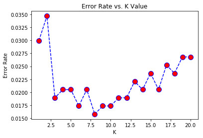
> K-Nearest Neighbors error rate at at k=8.

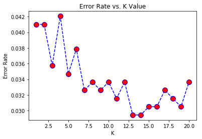
> K-Nearest Neighbors error rate at at k=13.

##### Decision Tree
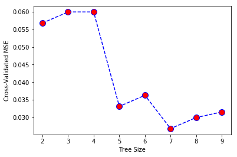
> Decision Tree error rate at at n=7.

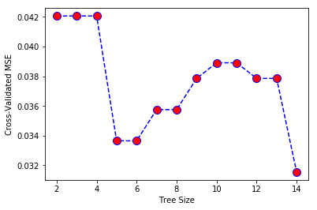
> Decision Tree error rate at at n=14.

##### Random Forest
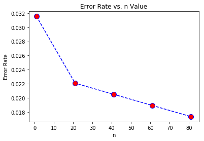
> Random Forest error rate at at n=81.

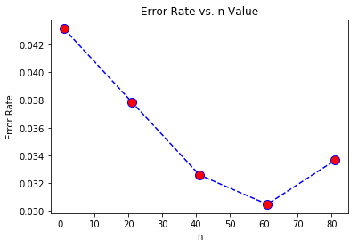
> Random Forest error rate at at n=61.

##### Support Vector Machine
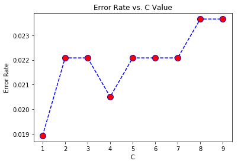
> Support Vector Machine error rate at at C=1.

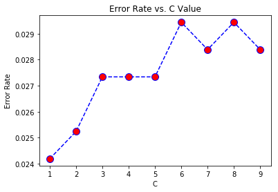
> Support Vector Machine error rate at at C=1.

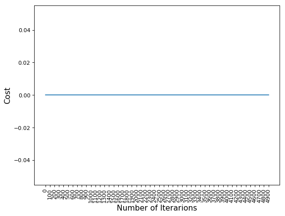
> 3-layer Neural Network Model

### For further information
Please review the narrative of our analysis in [our jupyter notebook](./classification-methods-for-gender-voice.ipynb)

For any additional questions, please contact **shaileshshettd@gmail.com)

##### Repository Structure:

```
├── README.md                                     <- The top-level README for reviewers of this project.
├── classification-methods-for-gender-voice.ipynb <- narrative documentation of analysis in jupyter notebook
└── images                                        <- both sourced externally and generated from code
```
